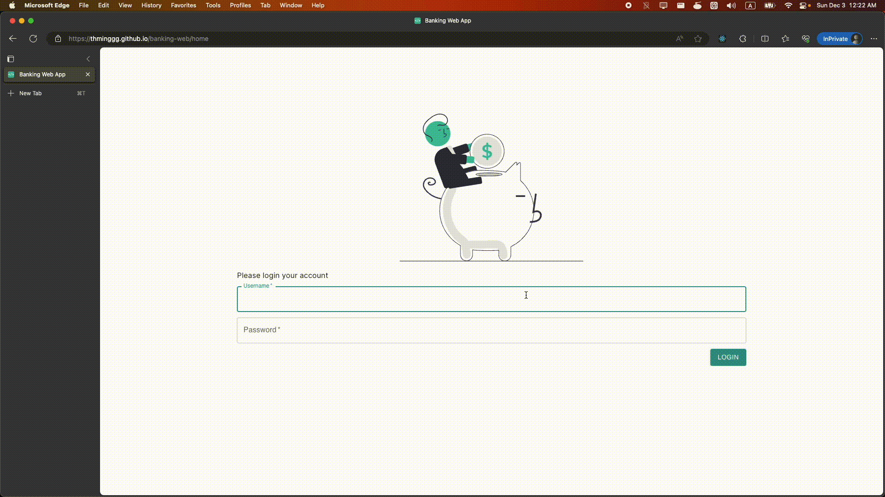

## Banking Web App

This repository demonstrates a banking web app with Progressive Web App (PWA) and offline page cache support.

## Live Demo

https://thminggg.github.io/banking-web/home


## Tech Stack

1. NextJS
2. Typescript
3. Web manifest
4. Service worker
5. `SSR` (`main` branch) & `SSG` (`gh-page` branch) handling
6. GitHub Actions
7. Material UI
8. Cypress
9. Scoped npm package - https://github.com/thminggg/react-vertical-resizable

## Getting Started

Install npm packages:

```bash
npm install
```

Run the development server:

```bash
npm run dev

# Or production mode
npm run build
npm run start
```

Open [http://localhost:3000/banking-web/home](http://localhost:3000/banking-web/home) with your browser to see the web application.

## Testing

Run test on Github Page:

```
npm run test:gh-page
```

<br />
OR

<br />

Run the development server:

```
npm run dev
```

Open a new terminal and run test:

```
cd cypress
npm install
npm run test:local
```
